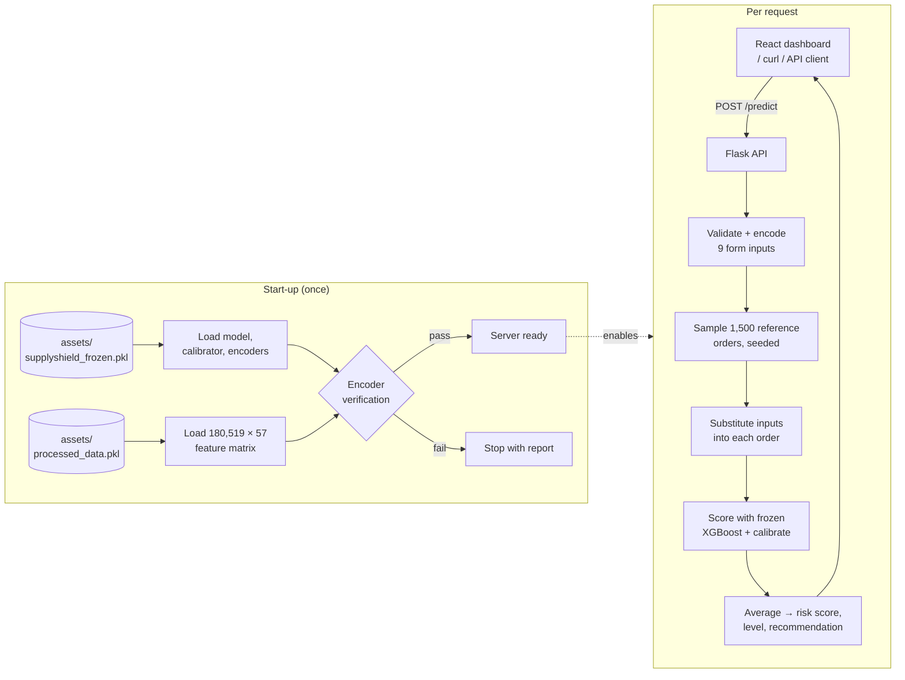

<div align="center">

# 📦 SupplyShield AI
### Predictive Shipment Delay Intelligence

**IBM SkillsBuild × AICTE Data Analytics with AI Internship 2026** · Internship ID `IBMUEDA1357`


-A24B34?style=flat-square&logo=react&logoColor=white)


**Author:** Akanksha Singh · Dept. of CSE (Data Science), Noida Institute of Engineering and Technology

</div>

---

SupplyShield AI estimates the probability that a shipment will be delivered late **before it is dispatched**, and turns that probability into a risk level and a recommended action for the logistics team. The whole application — REST API and React dashboard — lives in one Python file and needs no front-end build step.

<div align="center">

| 🎯 Task | 📊 Dataset | 🏆 Best model | 🎚️ Output |
|---|---|---|---|
| Binary classification | 180,519 orders | XGBoost · 92.58% ROC-AUC | Risk score 0–100 + action |

</div>

---

## Contents

1. [Highlights](#highlights)
2. [Quick start](#quick-start)
3. [Project structure](#project-structure)
4. [How a prediction is produced](#how-a-prediction-is-produced)
5. [Form inputs](#form-inputs)
6. [Reading the results](#reading-the-results)
7. [Model and dataset](#model-and-dataset)
8. [API reference](#api-reference)
9. [Known limitations](#known-limitations)
10. [Troubleshooting](#troubleshooting)
11. [Credits](#credits)

---

## Highlights

| | |
|---|---|
| **Task** | Binary classification of `Late_delivery_risk` (1 = delayed) |
| **Dataset** | DataCo Smart Supply Chain, 180,519 orders |
| **Production model** | XGBoost (1,400 boosting rounds), isotonic-calibrated probabilities |
| **Held-out test performance** | Accuracy 84.87 % · Precision 85.51 % · Recall 87.18 % · F1 86.34 % · ROC-AUC 92.58 % |
| **Output** | Risk score (0–100), risk level (Low / Medium / High), recommended action |
| **Deployment** | Single file, model loaded once from `assets/`, no retraining at run time |
| **Deterministic** | The same input always returns the same score |

---

## Quick start

**Requirements:** Python 3.10 or newer.

```bash
pip install -r requirements.txt
python Akanksha_Singh_SupplyShieldAI.py
```

Open **http://localhost:5000**. A healthy start-up prints:

```
Loading frozen model...
Model: XGBoost | boosting rounds=1400 | features=57 | operating threshold=0.43
57 features loaded.
Processed assets loaded.
Encoders verified against processed data (shipping mode, market, segment, department).
Model wiring check: 94.5% agreement with real labels on 1500 reference orders.
Server ready.
```

If the encoder verification fails, the server stops and lists the mismatch instead of serving wrong predictions.

---

## Project structure

```
SupplyShield_AI/
├── Akanksha_Singh_SupplyShieldAI.py   # Flask API + embedded React dashboard
├── requirements.txt
├── README.md
├── Akanksha_Singh_SupplyShieldAI_Report.docx # Project report
└── assets/
    ├── supplyshield_frozen.pkl        # trained XGBoost, calibrator, encoders, metrics
    └── processed_data.pkl             # 180,519 × 57 processed feature matrix
```

The raw Kaggle CSV is **not** needed to run the application.

The source file is organised into numbered sections: imports, constants and encoder tables, Flask app, utilities, feature engineering, model loading and start-up verification, an optional training block, API routes and prediction engine, the embedded front-end, and the main guard.

### Architecture at a glance



---

## How a prediction is produced

The model was trained on **57 features**, but the form collects **9**. Features such as the destination city, product or payment type are not known when an order is being planned, so they cannot be entered by the user.

For each request the server therefore:

1. **Validates** the input and reports anything outside the range the model was trained on.
2. **Encodes** the form values to the integer codes the model was trained with (see [Data encoding](#data-encoding)).
3. Takes a **fixed sample of 1,500 real training orders** (seeded, so it never changes).
4. **Substitutes the nine form inputs** — and every feature derived from them, such as urgency, weekend and peak-season flags, order value and the market × shipping-mode interaction — into each of those orders.
5. Scores all 1,500 orders with the frozen XGBoost model, calibrates the probabilities and **averages** them.

The result is the expected delay probability for an order with these known attributes, averaged over the realistic variety of everything else. Nothing is hard-coded and nothing is random.

---

## Form inputs

| Field | Options | Range in training data |
|---|---|---|
| Shipping Mode | Standard Class, Second Class, First Class, Same Day | 4 modes |
| Scheduled Shipping Days | 0 – 10 (auto-set when the mode changes) | 0 – 4 |
| Market | Africa, Europe, LATAM, Pacific Asia, USCA | 5 markets |
| Customer Segment | Consumer, Corporate, Home Office | 3 segments |
| Department | Apparel, Book Shop, Discs Shop, Fan Shop, Fitness, Footwear, Golf, Health and Beauty, Outdoors, Pet Shop, Technology | 11 departments |
| Item Quantity | whole number | 1 – 5 |
| Discount Rate | percent | 0 – 25 % |
| Order Month | January – December | 1 – 12 |
| Order Weekday | Monday – Sunday | 0 – 6 |

Values outside the training range are still scored (clamped to the nearest trained value) and a note appears under the result. The same happens when the scheduled days do not match the shipping mode: in the training data every mode has exactly one lead time, so other combinations have never been seen by the model.

| Shipping mode | Scheduled days in training data |
|---|---|
| Same Day | 0 |
| First Class | 1 |
| Second Class | 2 |
| Standard Class | 4 |

---

## Reading the results

### Risk levels

| Delay probability | Level | Recommended action |
|---|---|---|
| below 33 % | Low | No immediate action required. Monitor order progress normally. |
| 33 % – 66 % | Medium | Flag order for review. Consider expedited shipping or supplier alert. |
| 66 % and above | High | Immediate intervention needed. Escalate to logistics manager and notify customer. |

The bands are defined in one constant, `RISK_BANDS`, and can be changed without touching anything else.

### What drives the score

In DataCo, delivery risk is dominated by the shipping mode. The table compares how often each mode is actually late in the dataset with what the tool returns for a typical order (2 items, 10 % discount).

| Shipping mode | Late in dataset | Tool score (typical order) |
|---|---|---|
| Standard Class | 38.1 % | 36 % |
| Same Day | 45.7 % | 44 % |
| Second Class | 76.6 % | 87 % |
| First Class | 95.3 % | 98 % |

Scores are an approximation of these base rates, typically within about ten points; the largest gap is Second Class.

Changing one input at a time from a Standard Class baseline moves the score by:

| Input | Score spread across all options |
|---|---|
| **Shipping mode** | **≈ 62 points** |
| Department | ≈ 5 points |
| Order month | ≈ 4 points |
| Order weekday | ≈ 3 points |
| Discount rate | ≈ 2.5 points |
| Item quantity | ≈ 2.5 points |
| Customer segment | ≈ 2 points |
| Market | ≈ 1.5 points |

This is a property of the data, not a fault in the application: in DataCo the late-delivery rate is almost identical (≈ 55 %) across markets, segments and departments. Only shipping mode carries a strong signal, and the feature-importance chart on the dashboard reflects that.

### Example scenarios

| Scenario | Score | Level |
|---|---|---|
| Standard Class, 4 days, default form | 36.2 | Medium |
| Same Day, 0 days | 44.2 | Medium |
| Second Class, 2 days | 86.9 | High |
| First Class, 1 day (**Load High-Risk Example**) | 98.3 | High |
| Standard Class, 4 days, Corporate, Pet Shop, November (**Load Low-Risk Example**) | 26.9 | Low |

The two example buttons send ordinary requests through the same path as the *Predict Shipment Risk* button. The low-risk example is the lowest-scoring combination the model produces; most Standard Class orders sit near the Low/Medium boundary.

---

## Model and dataset

**Dataset:** [DataCo Smart Supply Chain for Big Data Analysis](https://www.kaggle.com/datasets/shashwatwork/dataco-smart-supply-chain-for-big-data-analysis) — 180,519 orders, 54.83 % delayed.

**Preprocessing** (leakage-free)
- Post-delivery columns such as real shipping days, delivery status and order status are removed; personal data (names, e-mail, address fields) is removed.
- Order month and weekday are derived from the order date; further business features are engineered (urgency, weekend / peak-season / bulk / high-discount flags, order value, sine–cosine month and weekday, market × shipping-mode and other interactions).
- High-cardinality categoricals use smoothed target encoding and frequency encoding, learned from the training split only.
- 80 / 20 stratified split (`random_state=42`).

**Models compared** (held-out 20 % test split)

| Model | Accuracy | Precision | Recall | F1 | ROC-AUC |
|---|---|---|---|---|---|
| Logistic Regression | 70.12 | 77.53 | 64.08 | 70.17 | 76.48 |
| Decision Tree | 73.23 | 80.78 | 67.16 | 73.34 | 80.98 |
| Random Forest | 74.27 | 83.11 | 66.60 | 73.95 | 82.30 |
| **XGBoost (production)** | **84.87** | **85.51** | **87.18** | **86.34** | **92.58** |

Baselines are scored at the default 0.5 threshold. XGBoost uses an operating threshold of 0.43 chosen on a validation split, with isotonic probability calibration. The training code (randomised search, early stopping, calibration) is kept in section 7 of the source file for reference.

**Top model features:** Standard Class flag (22.9 %), Shipping Mode (21.6 %), scheduled days (12.3 %), Market × Shipping Mode (7.4 %), Shipping Urgency (3.9 %).

### Data encoding

The frozen model was trained on an integer-coded export of DataCo, so every categorical value inside the model is a code such as `"3"`, not a name. The application translates form values to those codes with tables at the top of the source file. The tables were derived from the processed dataset — not assumed — and are verified on every start-up:

- every coded category must have exactly the row count published for DataCo;
- every shipping mode must have one fixed scheduled lead time;
- every department must match its stored target and frequency encoding.

Two facts worth knowing:

- Shipping codes are `0 = First Class`, `1 = Same Day`, `2 = Second Class`, `3 = Standard Class`. Department codes are **not** alphabetical.
- The feature the training pipeline called *Express Shipping Flag* is 1 exactly for code `3`, i.e. **Standard Class**. The application shows it as **Standard Class Flag**.

---

## API reference

| Method | Path | Description |
|---|---|---|
| GET | `/` | Dashboard |
| GET | `/api/overview` | Dataset totals, delay rate, headline model metrics |
| GET | `/api/model_comparison` | Metrics for all four models |
| GET | `/api/feature_importance` | Top-15 XGBoost feature importances |
| GET | `/api/risk_distribution` | Low / Medium / High order counts over the full dataset |
| POST | `/predict` | Score one shipment |

### `POST /predict`

`Shipping Mode` is required. Omitted optional fields use the training-set typical value (Market `LATAM`, Segment `Consumer`, Department `Fan Shop`, quantity 1, discount 0.10, month 6, weekday 3, scheduled days = the mode's standard lead time) and are listed in `defaults_applied`.

```bash
curl -X POST http://localhost:5000/predict \
  -H "Content-Type: application/json" \
  -d '{
    "Shipping Mode": "Second Class",
    "Days for shipment (scheduled)": 2,
    "Market": "Europe",
    "Customer Segment": "Consumer",
    "Department Name": "Fan Shop",
    "Order Item Quantity": 2,
    "Order Item Discount Rate": 0.10,
    "Order Month": 6,
    "Order Weekday": 2
  }'
```

```json
{
  "risk_score": 87.9,
  "risk_level": "High",
  "recommended_action": "Immediate intervention needed. Escalate to logistics manager and notify customer.",
  "delay_probability": 0.8795,
  "raw_probability": 0.8751,
  "inputs_used": { "Shipping Mode": "Second Class", "Market": "Europe", "...": "..." },
  "defaults_applied": [],
  "warnings": [],
  "method": { "model": "XGBoost (frozen)", "reference_orders": 1500, "calibrated": true }
}
```

`Order Item Discount Rate` is a fraction (0.10 = 10 %). `Order Weekday` is 0 (Monday) to 6 (Sunday).

**Errors** return HTTP 400 with a message, for example:

```json
{ "error": "Unknown Shipping Mode 'Rail'. Valid values: Standard Class, Second Class, First Class, Same Day" }
```

---

## Known limitations

- **Shipping mode dominates.** The dataset carries little signal elsewhere, so market, segment, department, month and weekday move the score only a few points.
- **Four shipping modes only.** Air, sea, rail or road freight do not exist in DataCo, so the model cannot score them.
- **Approximate scores.** Because unknown features are averaged over real orders, the score is an expected value, not an order-specific forecast. It is not a substitute for carrier tracking data.
- **Retraining.** The bundled assets are integer-coded. The training block in the source file expects the raw CSV and would create name-based encoders, so the encoder tables would need updating after a retrain.
- **Development server.** `app.run` is intended for demonstration; use a production WSGI server for real deployment.

---

## Troubleshooting

| Symptom | Fix |
|---|---|
| `Missing production asset: assets/...` | Keep the `assets/` folder next to the `.py` file. |
| `Encoder verification FAILED` | The `.pkl` files and the encoder tables no longer match; restore the original assets. |
| Page shows old behaviour after an update | Hard-refresh the browser (Ctrl + Shift + R). The console prints `SupplyShield AI build v1.1.0`. |
| A red note "Prediction failed" under the result | The request was rejected or the server is not running; the note contains the reason. |
| Port 5000 already in use | Stop the other process or change `port=5000` in the last line of the file. |
| scikit-learn version warning on start-up | The model was saved with scikit-learn 1.6; newer versions load it with a harmless warning. |

Open the browser console (F12) to see every request sent to `/predict` together with the server's response.

---

## Credits

- Dataset: DataCo Global — *DataCo Smart Supply Chain for Big Data Analysis* (Kaggle).
- Built by **Akanksha Singh** as part of the IBM SkillsBuild × AICTE internship.
- For educational and internship-submission purposes.
